# Stacking-Blending
In this project, I participated in the *House Prices competition* on **Kaggle** and scored a top **3% on the leaderboard.**

I provided an in depth *Explanatory Data Analysis* of the problem with clear visualizations and used simple *Stacking* and *Blending* of different machine learning models to predict the target variable.

I hope you like it.
Here is a link of the kernel on Kaggle. If you like it, please **upvote** it on kaggle.
Thank You.

https://www.kaggle.com/shubhamksingh/top-3-stacking-blending-in-depth-eda

---

### Visualizations:

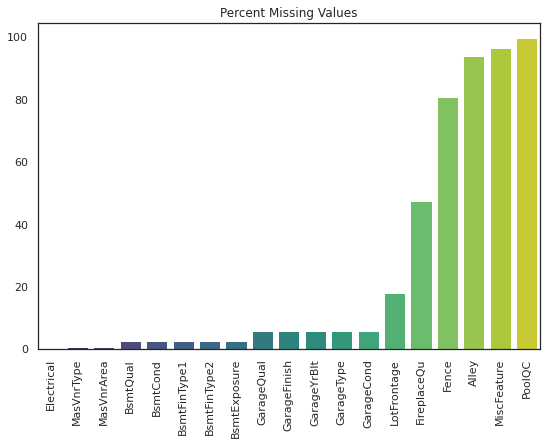
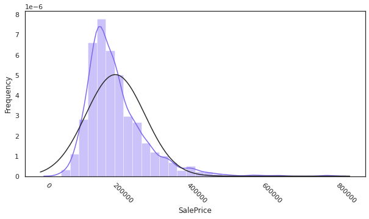
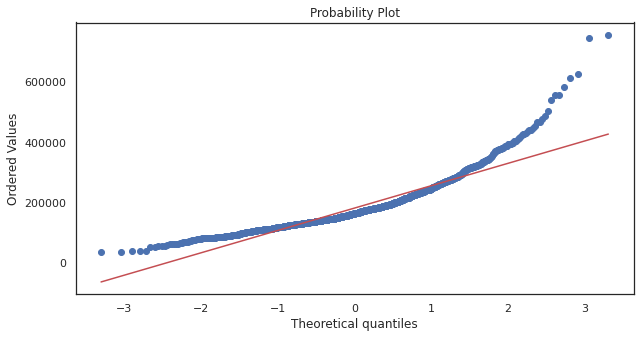
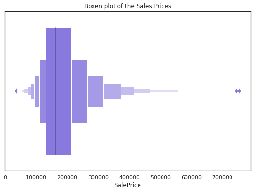
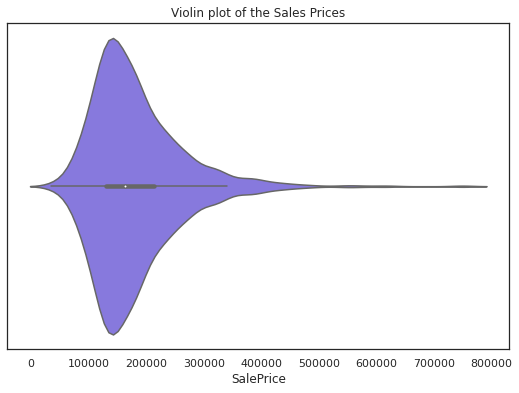
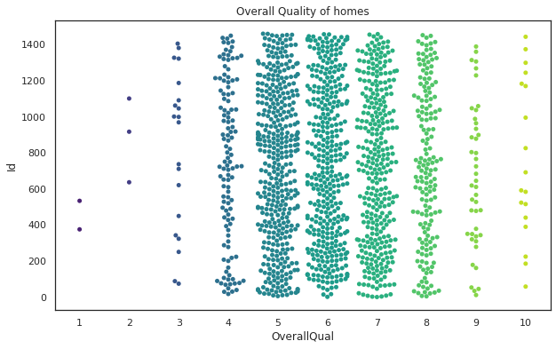
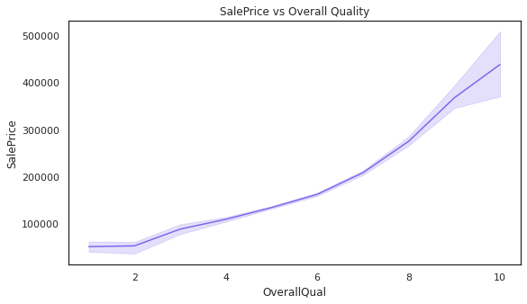
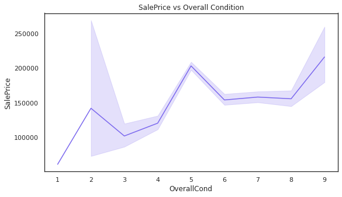
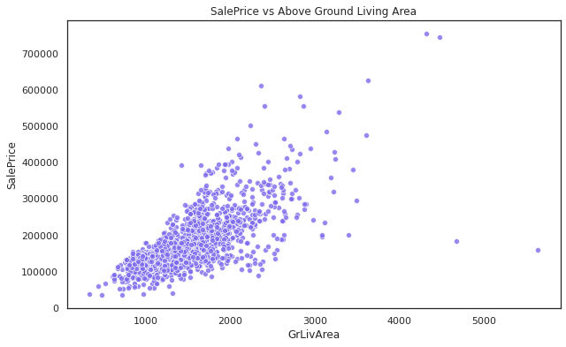
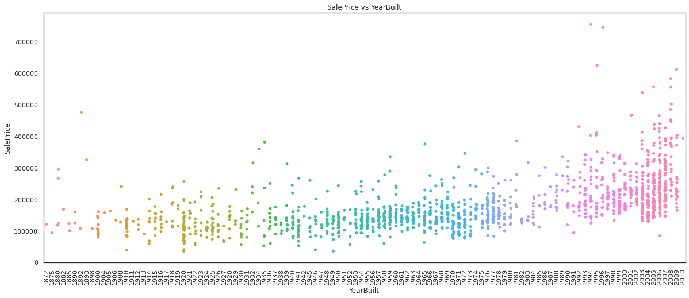
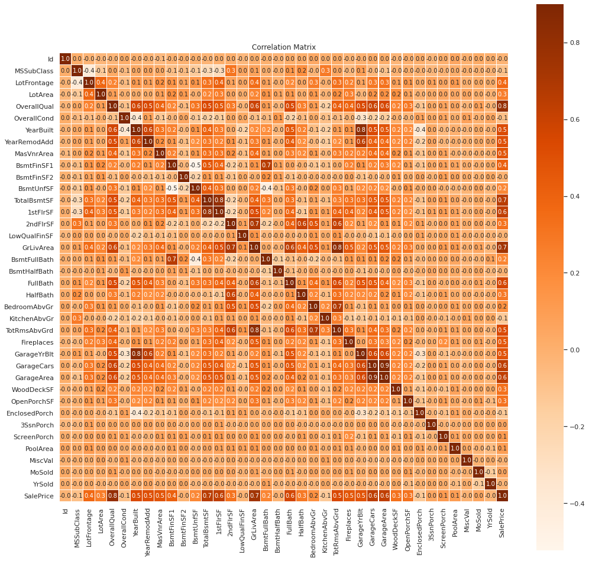
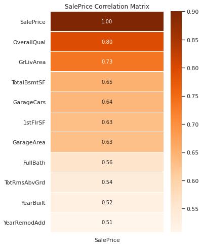
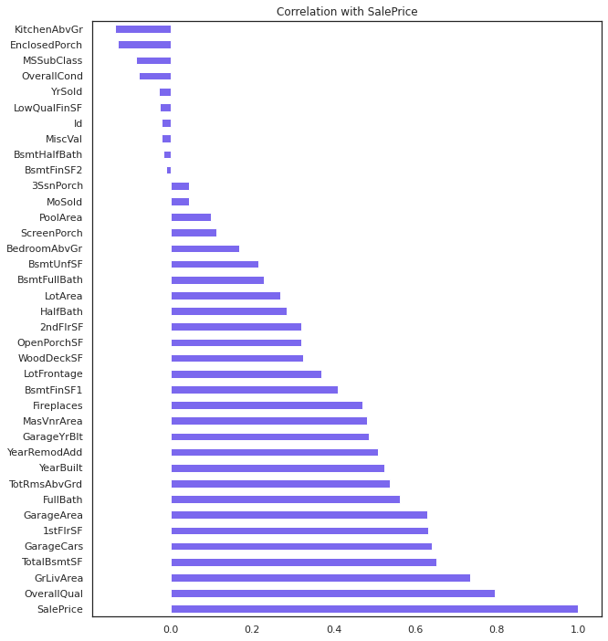
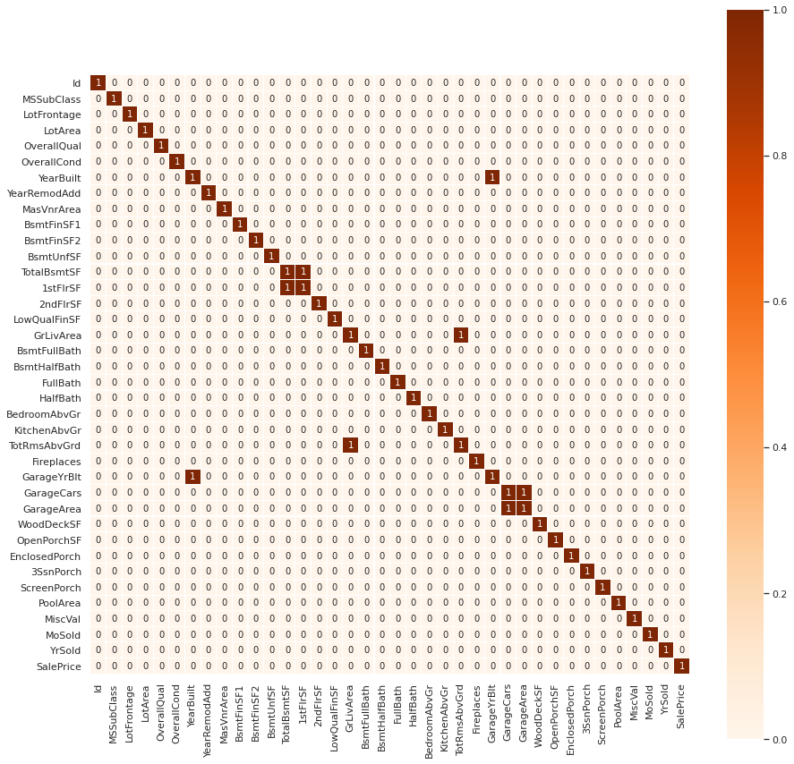
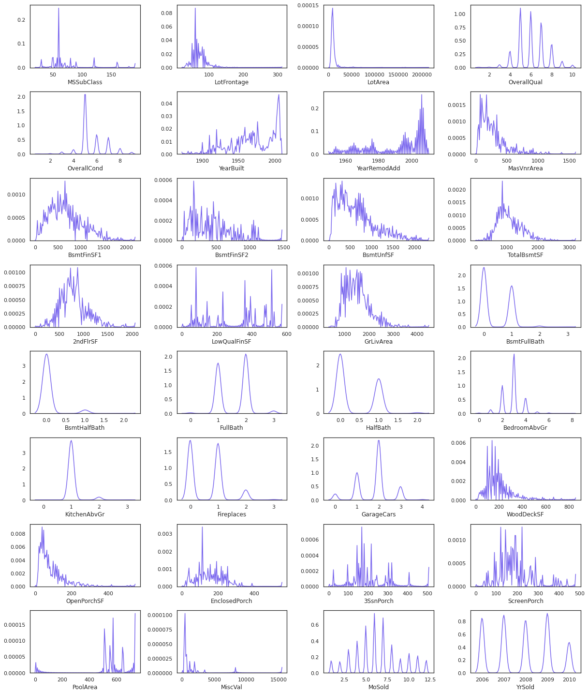
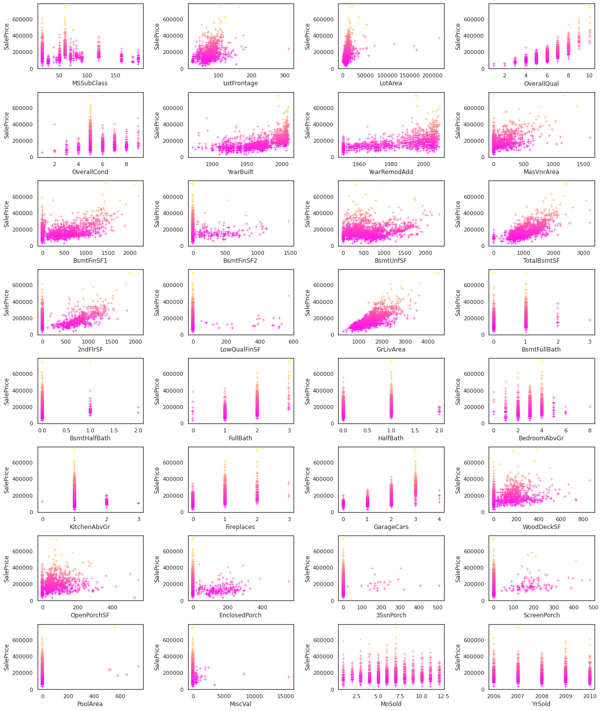
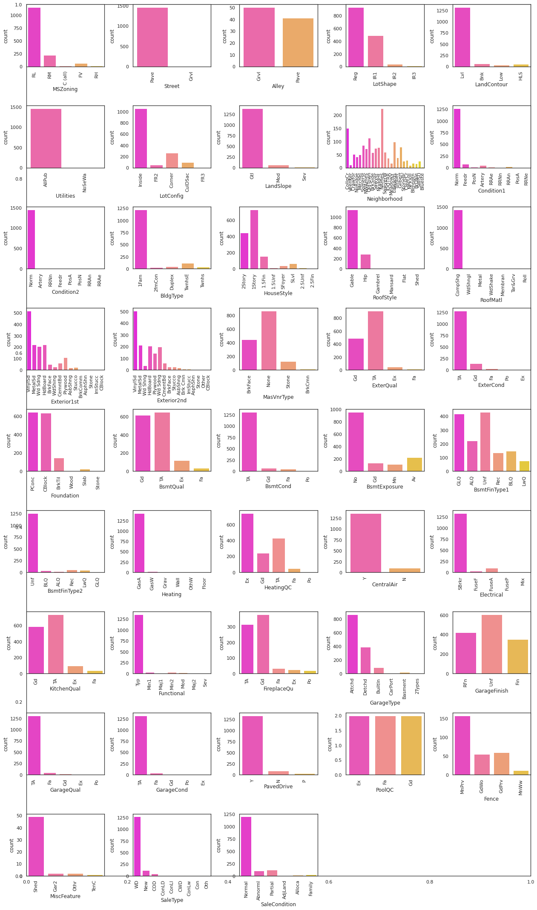
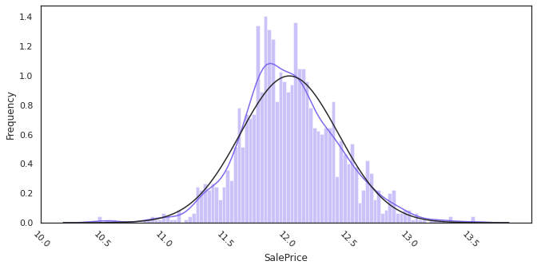
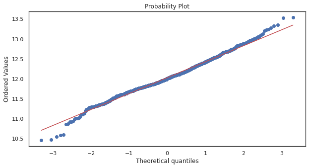
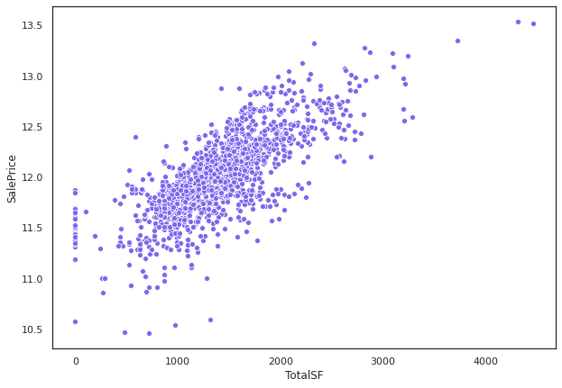
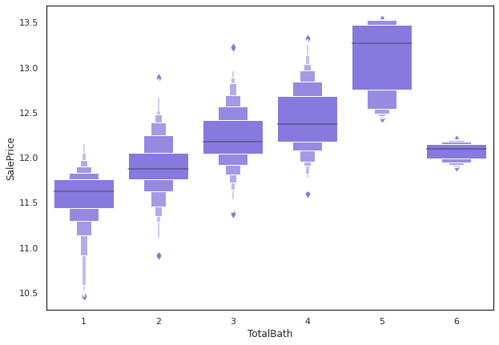
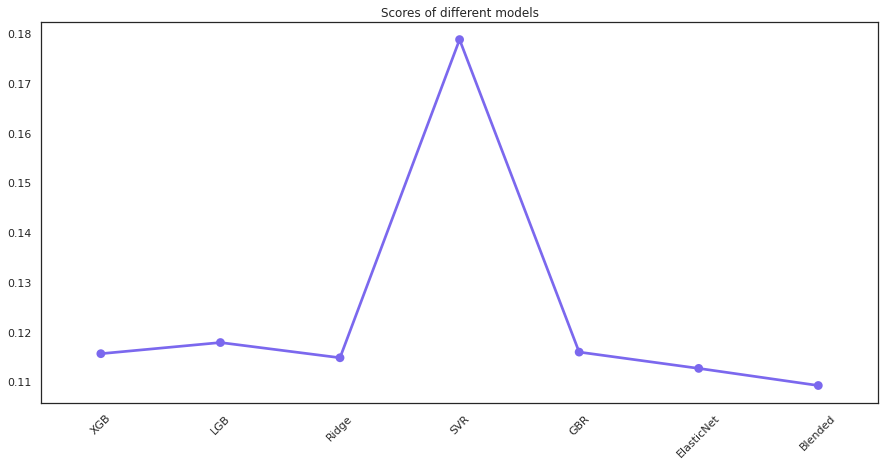
